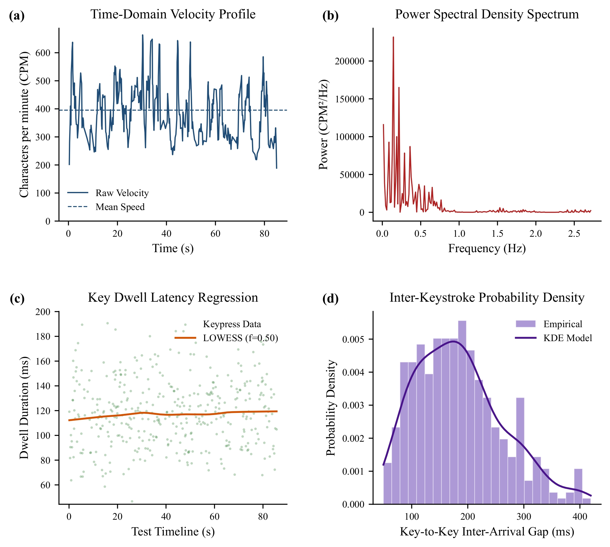
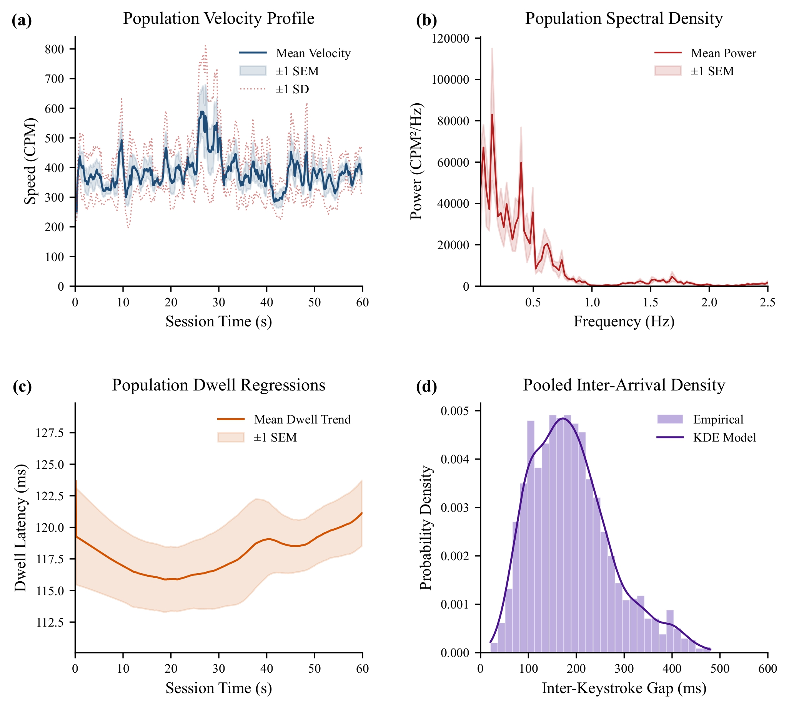

# Typing Rhythm Analysis

## Introduction

A tiny curiosity project that got wildly out of hand.

It started with a simple question: can Monkeytype typing data reveal a personal typing rhythm in the frequency domain? Somewhere along the way, this tiny experiment turned into an overengineered pipeline featuring linear interpolation, Silverman's Rule, LOOCV, and a proper CLI. The IEEE-style plots were entirely unnecessary—but they were way too much fun to make.

---

## Example Output

### Single-Session Analysis

<p align="center">
  
</p>

*A four-panel summary generated from a single Monkeytype session, including velocity, spectral density, dwell latency, and inter-keystroke timing.*

### Population Analysis

<p align="center">
  
</p>

*Aggregate statistics across multiple typing sessions, highlighting long-term trends and variability.*

---

## Features

- Analyze individual Monkeytype sessions in both the time and frequency domains.
- Aggregate multiple sessions to identify long-term typing patterns.
- Batch-process an entire workspace with a single command.
- Import data from files, folders, stdin, or the clipboard.
- Export publication-style PDF figures.

---

## Project Structure

```text
typing-analysis-project/
├── README.md                       # Project documentation
├── examples/                       # Example figures shown in this README
│   ├── single_session_analysis.png
│   └── population_analysis.png
├── sessions/                       # Raw Monkeytype session JSONs
├── results/                        # Generated output directory (created at runtime)
└── analysis_tools/                 # Core source code
    ├── batch_analysis.py           # Automated batch processing
    ├── outlier_utils.py            # Outlier detection helper
    ├── population_analysis.py      # Population-level statistics
    ├── run_analysis.py             # Main CLI entry point
    ├── session_preprocessor.py     # Data cleaner and importer
    └── single_session_analysis.py  # Single-session analysis
```

---

## Setup

The project depends on a few common scientific Python libraries:

- `numpy`
- `matplotlib`
- `scipy`
- `statsmodels`

Install them using your preferred package manager:

```bash
# pip
pip install numpy matplotlib scipy statsmodels

# conda
conda install numpy matplotlib scipy statsmodels
```

---

## Usage

### 1. Data Preprocessing

Clean and standardize raw Monkeytype JSON data before analysis.

```bash
# Import a single JSON file
python analysis_tools/session_preprocessor.py path/to/your_session.json

# Import all JSON files in a folder
python analysis_tools/session_preprocessor.py path/to/your_folder

# Import from a raw JSON string
python analysis_tools/session_preprocessor.py --payload '{"events":[{"type":"keydown","data":{"code":"a"}}]}'

# Import from stdin
echo '{"events":[{"type":"keydown","data":{"code":"a"}}]}' | python analysis_tools/session_preprocessor.py --from-stdin

# Import directly from the clipboard
python analysis_tools/session_preprocessor.py --from-clipboard
```

### 2. Single-Session Analysis

Generate a detailed analysis for one typing session.

```bash
python analysis_tools/run_analysis.py single path/to/session.json
```

### 3. Population Analysis

Aggregate multiple sessions to identify broader typing trends.

```bash
# Analyze selected files
python analysis_tools/run_analysis.py population path/to/file1.json path/to/file2.json

# Analyze every valid file in a folder
python analysis_tools/run_analysis.py population path/to/sessions_dir
```

### 4. Batch Processing

Automatically preprocess new files, generate individual reports, and produce a population summary.

```bash
python analysis_tools/run_analysis.py batch
```

---

## Optional Arguments

The following flags are available for the `single`, `population`, and `batch` commands (where applicable):

| Argument | Description | Example |
|----------|-------------|---------|
| `--output_name` | Customize the output filename | `--output_name my_report` |
| `--dpi` | Override the default plot resolution | `--dpi 600` |
| `--sessions_dir` | Specify a custom input directory (Batch only) | `--sessions_dir path/to/dir` |

Example:

```bash
# Single-session analysis
python analysis_tools/run_analysis.py single path/to/session.json --output_name custom_report --dpi 600

# Batch processing
python analysis_tools/run_analysis.py batch --sessions_dir path/to/sessions_dir --output_name batch_summary --dpi 500
```

---

## Outputs

- **Vector PDF Figures** are written to the `results/` directory.

- **Execution Logs** are appended to `results/analysis_run_log.jsonl` for reproducibility and debugging.